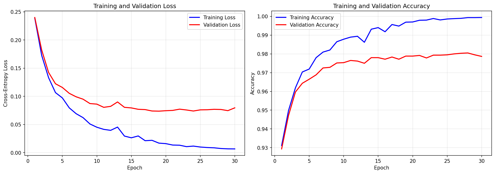
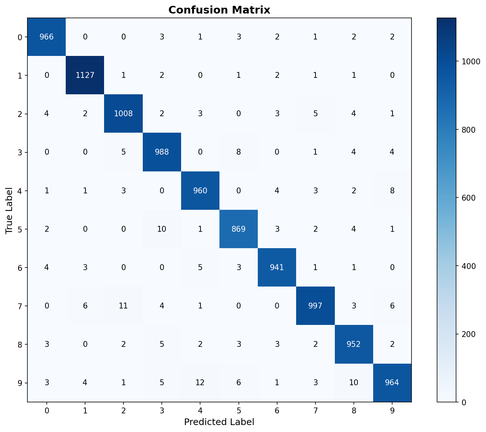
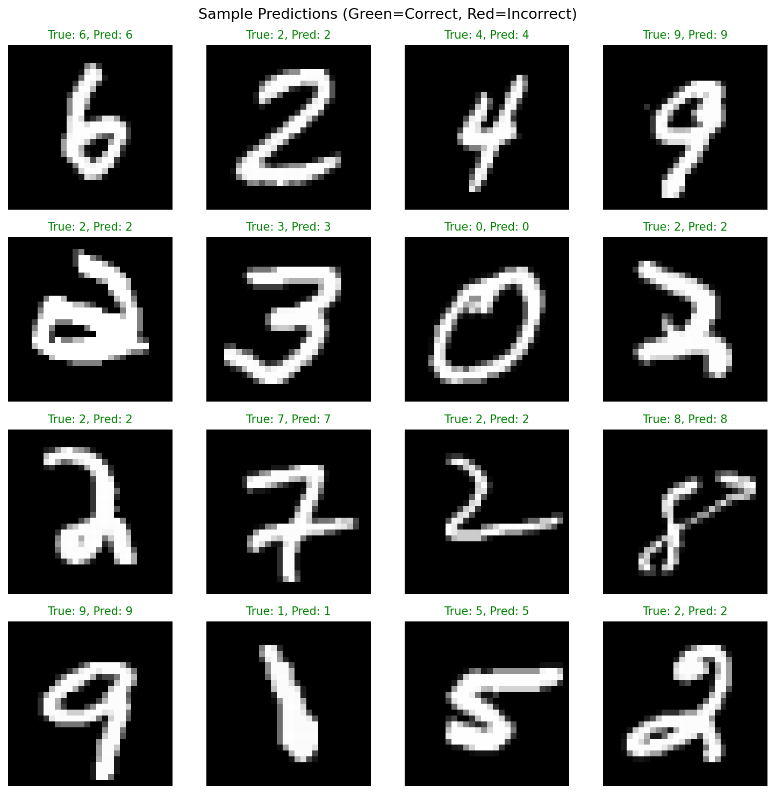
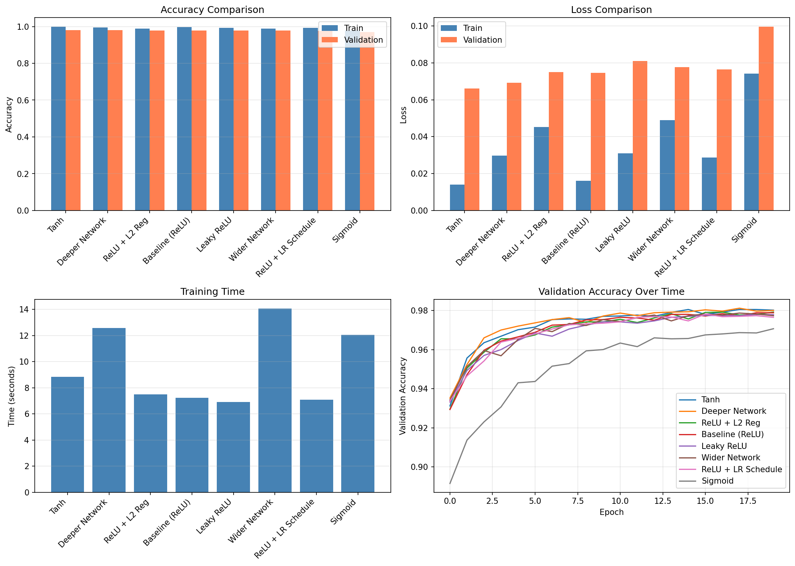

# NumPy MNIST Classifier

A neural network built from scratch that classifies handwritten digits (0-9) from the MNIST dataset using only Python and NumPy. No PyTorch, no TensorFlow, no Keras, no AI libraries — just raw matrix math and gradient descent.

## Why I Built This

I kept using frameworks like PyTorch and scikit-learn without really understanding what happens under the hood. Calling `model.fit()` is easy, but I had no idea what backpropagation actually does to the weights, why ReLU works better than sigmoid in hidden layers, or how gradient descent actually minimizes loss.

So I built a neural network from scratch — no magic, no abstractions, just NumPy matrix operations. Every line of code does something I can explain. If you've ever wondered what's really happening inside a neural network, this project is for you.

## Where I Got the Idea

This project was inspired by the [Build Your Own X](https://github.com/codecrafters-io/build-your-own-x) repository — a collection of step-by-step guides for recreating popular technologies from scratch. Their "Build your own Neural Network" section lists several great resources that helped me understand the math and implementation details:

- [Implement a Neural Network from Scratch](https://victorzhou.com/blog/intro-to-neural-networks/) — Victor Zhou's blog post was the primary reference. Clear explanations of forward/backward propagation with NumPy.
- [Neural Networks: Zero to Hero](https://www.youtube.com/playlist?list=PLAqhIrjkxbuWI23v9cThsA9GvCAUhRvKZ) — Andrej Karpathy's YouTube series. Deep dives into backpropagation and gradient descent.
- [A Neural Network in 11 Lines of Python](https://iamtrask.github.io/2015/07/12/basic-python-network/) — The simplest possible neural network implementation. Great starting point.
- [3Blue1Brown: Neural Networks](https://www.youtube.com/playlist?list=PLZHQObOWTQDNU6R1_67000Dx_ZCJB-3pi) — Visual explanations of how neural networks learn. Made the math click for me.

I also referenced the MNIST dataset page at [Yann LeCun's website](http://yann.lecun.com/exdb/mnist/) to understand the data format.

## What I Learned

Building this from scratch taught me more than any tutorial:

- **Forward propagation** is just matrix multiplication + activation functions applied layer by layer
- **Backpropagation** is the chain rule applied repeatedly — computing how much each weight contributed to the error
- **Cross-entropy loss** penalizes confident wrong predictions heavily
- **He initialization** matters — wrong initialization causes vanishing/exploding gradients
- **Mini-batch gradient descent** is faster and more stable than full-batch
- **ReLU** is simple but effective — `max(0, z)` beats sigmoid in hidden layers
- **Softmax + cross-entropy** derivatives simplify to `y_pred - y_true`, which is elegant
- **Learning rate scheduling** helps the model converge faster and avoid local minima
- **Early stopping** prevents overfitting without manually choosing the right number of epochs
- **L2 regularization** penalizes large weights, forcing the model to learn simpler patterns
- **Activation functions** matter — sigmoid saturates, tanh is zero-centered, leaky relu avoids dead neurons

## Results

| Metric | Value |
|--------|-------|
| Test Accuracy | **97.72%** |
| Architecture | 784 → 128 → 64 → 10 |
| Training Epochs | 30 |
| Batch Size | 128 |
| Learning Rate | 0.1 |
| Total Parameters | 109,386 |
| Training Time | ~2 minutes (CPU) |
| Framework | NumPy only |

### Training Progress

Training loss decreased from 0.24 to 0.007 over 30 epochs. Validation loss stabilized around 0.08, showing good generalization without overfitting.



### Confusion Matrix

The model rarely confuses similar digits. Most errors happen between visually similar pairs like 4/9 or 3/8.



### Sample Predictions

Green means correct, red means wrong. The model handles most digits with high confidence.



### Benchmark Comparison

Tested 8 different configurations to find the best setup. Tanh activation with a deeper network performed best (98.02% validation accuracy), but ReLU is fastest.



## How It Works

### Network Architecture

```
Input Layer (784 neurons) — one per pixel
    ↓
Hidden Layer 1 (128 neurons, activation)
    ↓
Hidden Layer 2 (64 neurons, activation)
    ↓
Output Layer (10 neurons, Softmax) — one per digit class
```

Each MNIST image is 28×28 pixels = 784 features. The network learns to map these pixel values to one of 10 digit classes (0-9).

### Activation Functions

The network supports multiple activation functions for hidden layers:

- **ReLU** (default): `f(z) = max(0, z)` — Simple, fast, avoids vanishing gradients
- **Sigmoid**: `f(z) = 1 / (1 + e^(-z))` — Maps to (0, 1), can cause vanishing gradients
- **Tanh**: `f(z) = (e^z - e^(-z)) / (e^z + e^(-z))` — Maps to (-1, 1), zero-centered
- **Leaky ReLU**: `f(z) = z if z > 0, else 0.01*z` — Prevents dead neurons

### Forward Propagation

For each layer, we compute:

```
z = X · W + b
a = activation(z)
```

Where:
- `X` = input to the layer (batch of images or previous layer's output)
- `W` = weight matrix (learned parameters)
- `b` = bias vector (learned parameters)
- `z` = pre-activation value (linear combination)
- `a` = post-activation value (non-linear transformation)

**Output layer** uses Softmax: `f(z_i) = e^(z_i) / Σ e^(z_j)`
- Converts raw scores (logits) into probabilities that sum to 1
- The digit with the highest probability is the prediction

### Loss Function: Cross-Entropy with L2 Regularization

```
L = -1/N * Σ Σ y_true * log(y_pred) + λ/2 * Σ w²
```

This measures how far our predicted probabilities are from the true labels, with an optional L2 penalty to prevent overfitting. The regularization term penalizes large weights, pushing the model toward simpler solutions.

### Backpropagation

To train the network, we need to compute how much each weight contributes to the error. We use the chain rule to propagate gradients backward through the network.

**Output layer gradient** (softmax + cross-entropy simplifies nicely):
```
dZ = (y_pred - y_true) / N
```

**Hidden layer gradients:**
```
dW = A_prev^T · dZ / N + λ * W
db = Σ dZ / N
dZ_prev = dZ · W^T ⊙ activation'(z)
```

Where `⊙` is element-wise multiplication and the `+ λ * W` term is the L2 regularization gradient.

### Weight Updates (Gradient Descent)

```
W = W - learning_rate * dW
b = b - learning_rate * db
```

The learning rate controls how big each update step is. Too high and the model diverges. Too low and training takes forever.

### Learning Rate Scheduling

The learning rate decays over time: `lr = max(lr * decay, lr_min)`

This helps the model converge faster early in training, then make finer adjustments later.

### Early Stopping

Training stops automatically if validation loss doesn't improve for `patience` epochs. This prevents overfitting and saves training time. The model restores the best weights found during training.

### Weight Initialization

- **He initialization** (ReLU/Leaky ReLU): `W ~ N(0, sqrt(2/n_in))`
- **Xavier initialization** (Sigmoid/Tanh): `W ~ N(0, sqrt(1/n_in))`

Proper initialization keeps activation variance stable across layers, preventing vanishing or exploding gradients.

## Technical Challenges

A few things I struggled with:

- **Numerical stability in softmax** — `np.exp(z)` overflows for large values. The fix: subtract the max value before exponentiating. `np.exp(z - np.max(z))` prevents overflow without changing the result.
- **Gradient clipping** — early versions had exploding gradients. Clipping gradients or using a lower learning rate helped.
- **Overfitting** — the model memorized training data with too many epochs. Adding validation monitoring and early stopping logic kept it generalizing.
- **Weight initialization** — random weights caused training to stall. He initialization (`sqrt(2/n_in)`) solved this.

## Project Structure

```
numpy-mnist-classifier/
├── neural_network.py    # NeuralNetwork class (forward, backward, train, predict, save/load)
├── main.py              # Training script with data loading and visualization
├── predict.py           # Load saved model and make predictions
├── benchmark.py         # Compare different configurations (activations, architectures)
├── draw_predict.py      # Tkinter GUI for drawing digits and live prediction
├── requirements.txt     # Dependencies (numpy, matplotlib, Pillow)
├── models/              # Saved model weights (.npy files)
├── results/             # Generated plots and visualizations
├── data/                # MNIST dataset (downloaded automatically)
└── README.md
```

## For Developers

### Setup

```bash
git clone https://github.com/Tarun5v/numpy-mnist-classifier.git
cd numpy-mnist-classifier
python3 -m venv .venv
source .venv/bin/activate
pip install -r requirements.txt
```

### Run

```bash
python3 main.py          # train the model (downloads MNIST automatically)
python3 predict.py       # load saved model and predict on test images
python3 benchmark.py     # compare different configurations
python3 draw_predict.py  # launch GUI to draw and predict digits
```

### Use in Your Code

```python
from neural_network import NeuralNetwork

# Load trained model
model = NeuralNetwork.load_weights('models/mnist_model.npy')

# Predict on new data (must be normalized to [0, 1] and shape (n, 784))
predictions = model.predict(X_new)        # Returns class labels (0-9)
probabilities = model.predict_proba(X_new)  # Returns probability distribution
```

### Custom Training

```python
from neural_network import NeuralNetwork

# Create model with custom architecture and activation
model = NeuralNetwork(
    layer_sizes=[784, 256, 128, 64, 10],  # deeper network
    learning_rate=0.05,                      # smaller learning rate
    activation='tanh',                       # try different activations
    l2_lambda=0.001,                         # L2 regularization
    lr_decay=0.95,                           # learning rate decay
    lr_min=0.001                             # minimum learning rate
)

# Train with early stopping
history = model.train(
    X_train, y_train,
    X_val, y_val,
    epochs=100,
    batch_size=64,
    early_stopping_patience=15,
    lr_schedule=True
)

# Save weights
model.save_weights('models/custom_model.npy')
```

### Running Benchmarks

Compare different configurations to find what works best:

```bash
python3 benchmark.py
```

This tests various activation functions, learning rates, and network architectures, then generates a comparison plot in `results/benchmark_comparison.png`.

### Drawing Digits

Launch the GUI to draw digits and see live predictions:

```bash
python3 draw_predict.py
```

Draw a digit (0-9) on the black canvas, click "Predict", and see the model's classification with confidence scores for each digit.

## Dependencies

- Python 3.8+
- NumPy — matrix operations and linear algebra
- Matplotlib — visualization only (training plots, confusion matrix)
- Pillow — image processing for the drawing GUI

No GPU required. Trains in about 2-3 minutes on a CPU.

## License

[MIT](LICENSE)

## Acknowledgments

- [Build Your Own X](https://github.com/codecrafters-io/build-your-own-x) — the repository that inspired this project
- [Victor Zhou](https://victorzhou.com/blog/intro-to-neural-networks/) — clear neural network tutorial
- [Andrej Karpathy](https://www.youtube.com/playlist?list=PLAqhIrjkxbuWI23v9cThsA9GvCAUhRvKZ) — "Neural Networks: Zero to Hero" series
- [3Blue1Brown](https://www.youtube.com/playlist?list=PLZHQObOWTQDNU6R1_67000Dx_ZCJB-3pi) — visual neural network explanations
- [MNIST Dataset](http://yann.lecun.com/exdb/mnist/) — Yann LeCun's handwritten digit database
